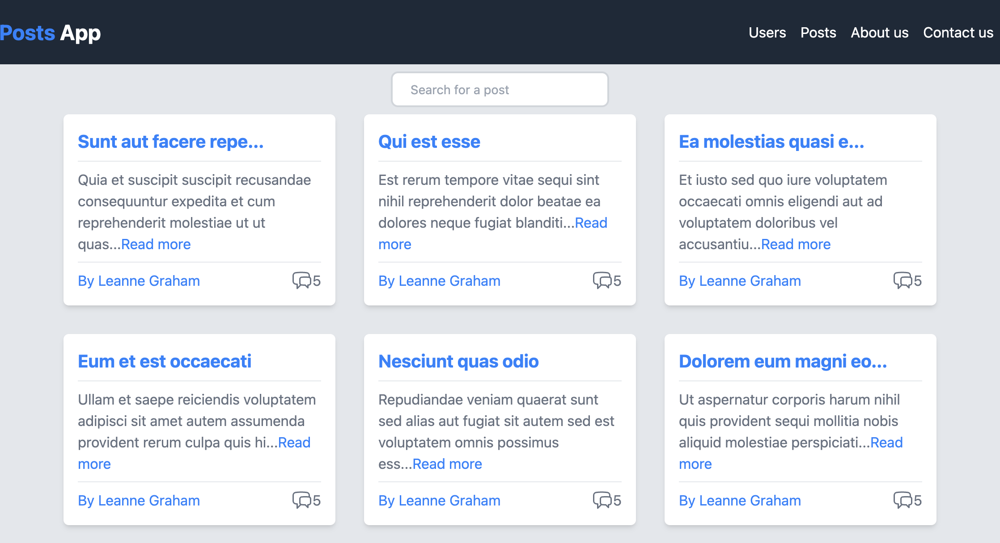
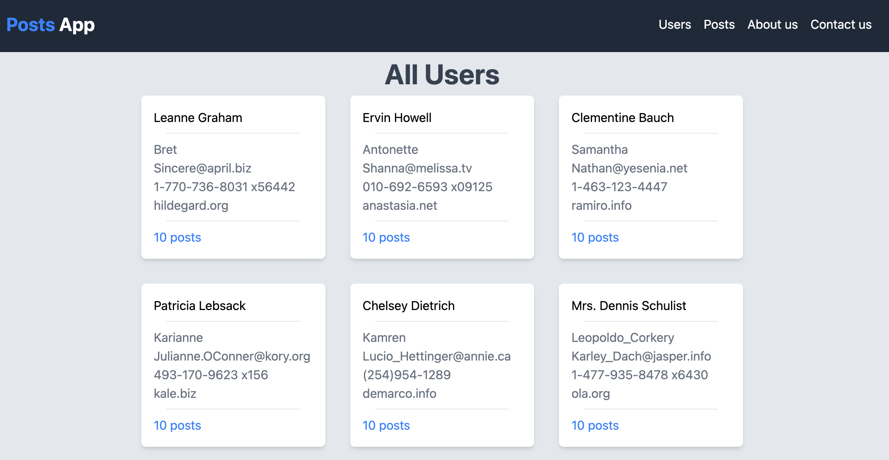
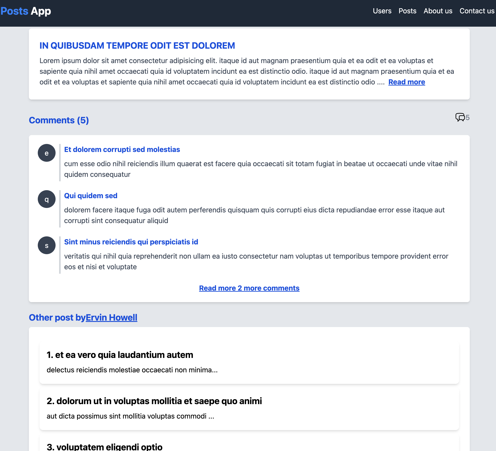
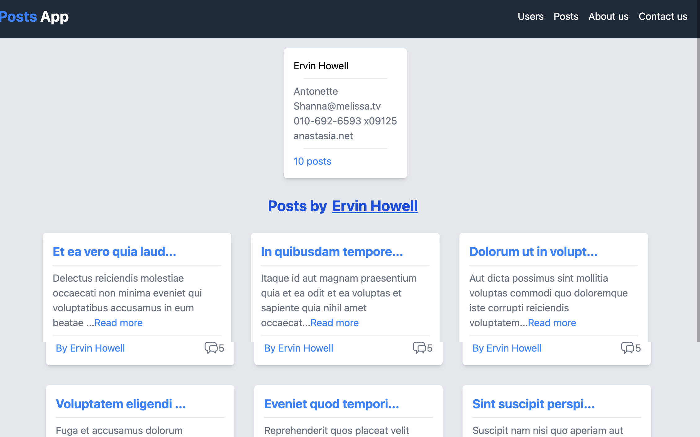

# Name of the project: 
Frontend React Project - Posts

## Link to the demo: 
[https://cah4o.github.io/bof-posts/](https://cah4o.github.io/bof-posts/) 

## Tech stack: 
- HTML;
- CSS;
- Typescript;
- React with Redux, React Router, Material UI, Axios; 
- REST API.

## Description:
The extra assignment under the BOF program. All requirements from the Integrify academy are described below.
The site consists of several pages, showing all posts, a single selected post, all users and a single selected user. To redirection I used a React Router Dom (AppRouter.ts).
Reducers and the global storag were implemented to work with posts, users and comments (redux folder). All data fetched by using axios (api.ts) and thunk functions in reducers through fake REST API. All data types and interface in (types folder). Implement the creation a post, creation/removing a comment, but the API not allow to change the data and it is saved temporarily.

## Requirement from the acadamy:
### Introduction
This is an extra and optional React project to improve your skills with React.
It is a simple project that allows you to fetch posts from a server and display them in a list.It is a good project to practice your skills with React and Redux.`

## Instructions

### General

Fork this repo, then clone the **fork** to your machine and start working on it. You can open a pull request as soon as possible (no need to wait until finished)
For styling, you can use whatever css solution you want: css, scss, Material UI, etc.
You need to install the css library yourself.

### Step 1

- Fetch all the posts and return the data from [JSONPlaceholder](https://jsonplaceholder.typicode.com/posts)
- Fetch all the users and return the data from [JSONPlaceholder](https://jsonplaceholder.typicode.com/users)
- Fetch all the comments and return the data from [JSONPlaceholder](https://jsonplaceholder.typicode.com/comments)

- Given a post, user or comment id return the corresponding data from the server

### Step 2

- Render the data of all the posts and users (from Step 1). you can use any css library you want (css, scss, Material UI, etc.)
- Make sure to split the component into smaller components (e.g. Post, PostList, etc.)

### Step 3

- Integrate react router into your project and create atleast 2 pages:
  - `HomePage`: renders the list of posts
  - `UsersPage`: renders the list of users
  - `singleUserPage`: renders specific user data and their posts
  - `PostPage`: renders the details of a post (title, body, comments and other details)

### Step 4

- Set up all the redux boilerblate for the project
- Everything related to redux stays in one folder: reducers, store
- Think about what reducer you're going to make and write them accordingly
- Move the state that contains all posts, users and comments to redux store

### Step 5

Take your time to implement the following features:

- Add a button to the `HomePage` that allows you to add a new post
- Add listing of of nested resources (comments) to the `PostPage`
- Add more features and make the project look good. You can use any css library you want (css, scss, Material UI, etc.)
- Add and remove comments from a post

## References

Homepage:

Users page:

Single Post page:

Single User page:

